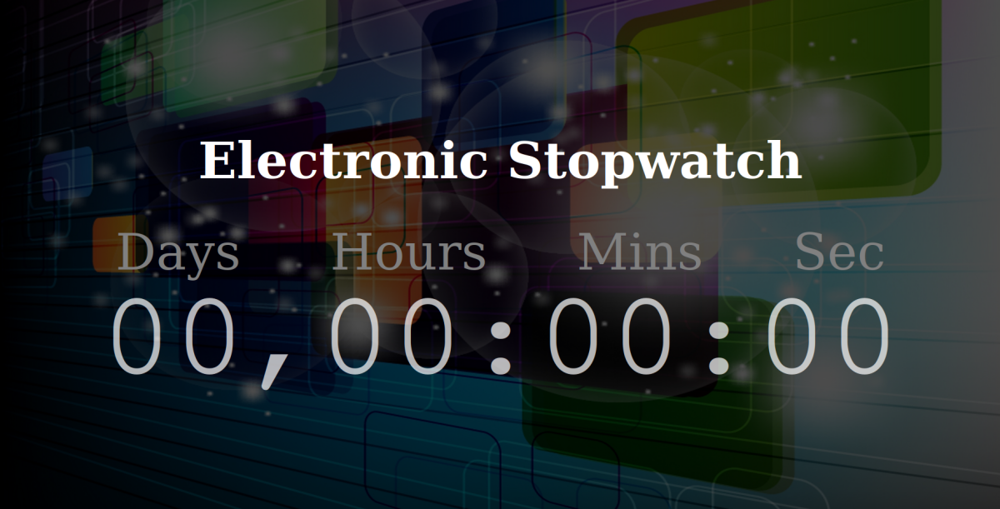
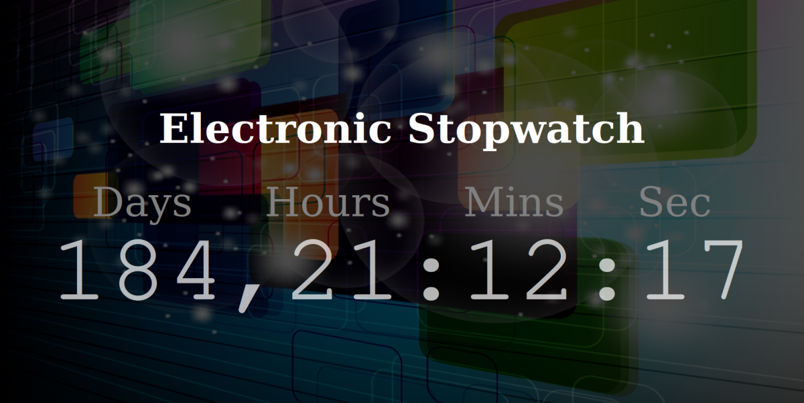

<h4 align="center">
     
    <b>Contagem regressiva! 😍</b>
</h4>

  
  

 

# HTML5 - CSS - JavaScript - Countdown Timer

Esse é um pequeno projeto de um cronômetro com contagem regressiva usando HTML, CSS, e JS

Autor: Brenno C. Lins

## Captura de tela

 

### Tecnologias usadas

Este projeto foi desenvolvido com as seguintes tecnologias:

- [HTML](https://developer.mozilla.org/pt-BR/docs/Web/HTML)
- [CSS](https://developer.mozilla.org/pt-BR/docs/Web/CSS)
- [JavaScript](https://developer.mozilla.org/pt-BR/docs/Web/JavaScript)
- [Git](https://git-scm.com/)

#### Esse simples projeto nos ensina:

- Criar um cronometro com os numeros subindo
- A trata data usando JavaScript
- Usar IFs com JavaScript
- Estilização e animação usando CSS
- Aplicar conceitos básicos de HTML na criação de um app web

### Como contribuir

- Fork esse repositório;
- Crie uma branch com a sua feature: `git checkout -b meu-cronometro`
- Commit suas mudanças: `git commit -m 'feat: Minha nova funcionalidade'`
- Push a sua branch: `git push origin meu-cronometro`

### De onde eu me baseei para fazer esse projeto?

O canal no youtube <b>Code Spot</b> [Build a rotating Countdown timer in Javascript](https://www.youtube.com/watch?v=VqToCBmqq6w)

### Links:

- [CODE SPOT](https://www.youtube.com/channel/UCNSe13znA4YRG-DQJSfjC2Q)
- [BCL-ST](https://www.bcl-st.com.br)

---

Feito com 😍 Brenno Dev 😍

